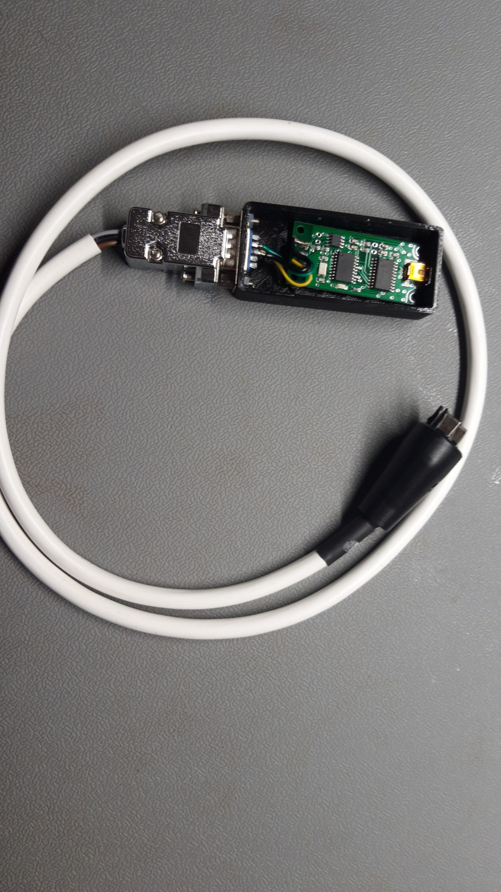

# Bosch charging port to USBtin cabel
## Cabel
| USBtin  | Charging Connector  |
|---------|:--------------------|
| GND     | GND / S1            |
| CANL    | CAN-L / S2          |
| CANH    | CAN-H / S3          |
| |  |



Source: 
 - [https://wiki.logre.eu/index.php/BOSCH_E-Bike#Connecteur_de_la_Batterie](https://wiki.logre.eu/index.php/BOSCH_E-Bike#Connecteur_de_la_Batterie)
 - [https://www.fischl.de/usbtin/#partlist](https://www.fischl.de/usbtin/#partlist)

## Init CAN Bus Interface
``` shell
sudo slcan_attach -f -s5 -o /dev/ttyACM0
sudo slcand ttyACM0 slcan0
sudo ip link set slcan0 type can bitrate 500000

candump slcan0

```
[DOC: Linux SocketCAN - fischl.de](https://www.fischl.de/usbtin/linux_can_socketcan/)
### BOM
 - [USBtin USB-CAN Interface](https://www.fischl.de/usbtin/)
 - [USBtin Case - Thingiverse.com](https://www.thingiverse.com/thing:4186146)
 - [Charge adapter -E-Bike Vision](https://www.e-bike-vision.de/produkt/ladeadapter-bosch/de)