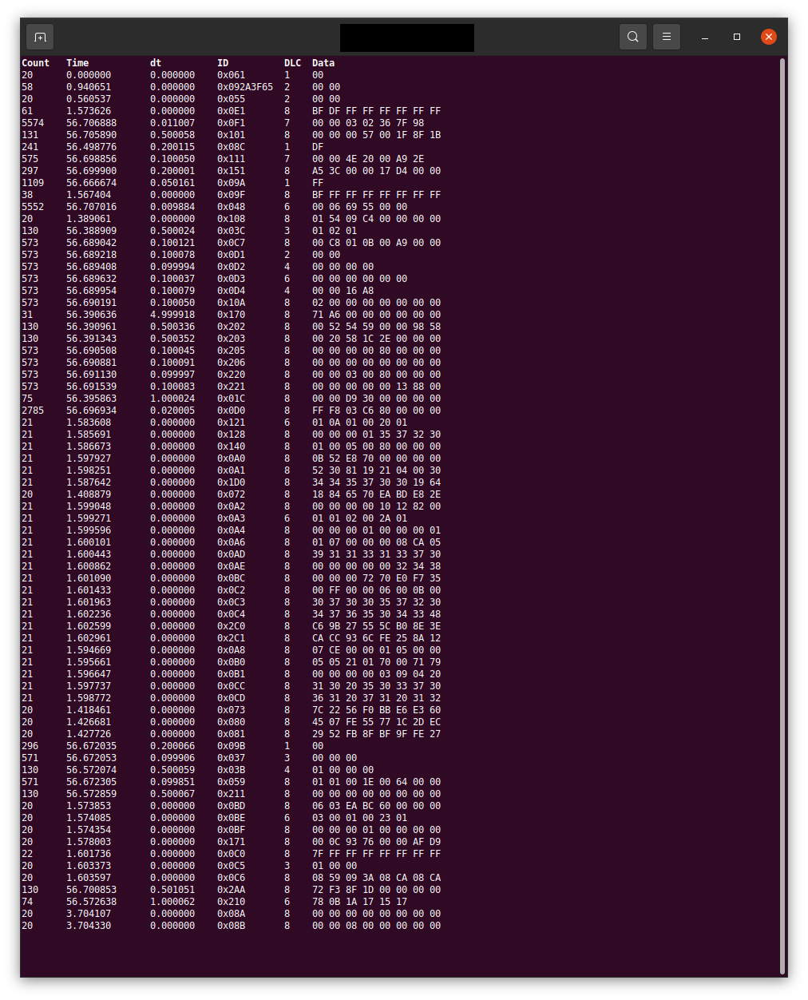

- [ebike](#ebike)
  - [CAN - BUS](#can---bus)
    - [CPC-USB Pinout](#cpc-usb-pinout)
    - [CAN Interface](#can-interface)
      - [SuperCAN](#supercan)
  - [CLI CAN-Bus Tools](#cli-can-bus-tools)
    - [can-utils](#can-utils)
      - [INSTALL on linux](#install-on-linux)
      - [Find CAN-BUS Interface](#find-can-bus-interface)
      - [Init CAN-Bus Interface](#init-can-bus-interface)
      - [Start/Stop Bosch eBike](#startstop-bosch-ebike)
    - [python-can](#python-can)
      - [Install](#install)
      - [can_viewer](#can_viewer)
    - [cannelloni](#cannelloni)
      - [Build cannelloni](#build-cannelloni)
      - [Install cannelloni](#install-cannelloni)
      - [VCAN Interface](#vcan-interface)
  - [KIOX](#kiox)
    - [Teardown](#teardown)
    - [Hardware](#hardware)
    - [Error Codes](#error-codes)
  - [Android App](#android-app)
    - [Appium](#appium)
      - [Sources](#sources)
  - [Links](#links)
    - [Bosch](#bosch)
      - [Bosch Manuals](#bosch-manuals)
      - [Bosch Source Software licenses](#bosch-source-software-licenses)
    - [Youtube](#youtube)
    - [Car Hacking](#car-hacking)
    - [Tools](#tools)
    - [Pedelecforum.de (German)](#pedelecforumde-german)

# ebike

Reverse Engineering: Bosch eBike System with "Performance Line Speed" (Gen4) and "Kiox Sporty Connectivity"

## CAN - BUS
[Pedelecs until 2013](https://www.pedelecforum.de/forum/index.php?threads/classic-can-bus-daten-usw.17799/page-5#post-542919)

GREEN: CAN-H

YELLOW: CAN-L

BLACK: Ground

RED: 12V, max. 1A
### CPC-USB Pinout
The CAN interface connector (D­Sub 9 male) for the standardversion complies to CiA Standard DS 102.

| Pin | Name  | 
|-----|:------|
| 1   | RTL   |
| 2   | CAN_L |
| 3   | GND   |
| 4   | -     |
| 5   | -     |
| 6   | -     |
| 7   | CAN_H |
| 8   | RTH   |
| 9   | -     |

### CAN Interface
#### SuperCAN
A cheap way to get a USB CAN Bus interface is the [Adafruit Feather M4 CAN Express](https://www.adafruit.com/product/4759) board. The [SuperCAN](https://github.com/jgressmann/supercan) project support it sice firmware release [v1.0.14](https://github.com/jgressmann/supercan/releases/tag/v1.0.14). After build and install the linux driver set it up like a common CAN USB interface. SuperCAN also supports CAN FD may be interesting for the new BOSCH Smart System.

A big thanks to  [Jean Gressmann](https://github.com/jgressmann)

## CLI CAN-Bus Tools
### can-utils
[can-utils - github](https://github.com/linux-can/can-utils)

#### INSTALL on linux
  
    sudo apt install can-utils

#### Find CAN-BUS Interface

    ip a

    1: lo: <LOOPBACK,UP,LOWER_UP> mtu 65536 qdisc noqueue state UNKNOWN group default qlen 1000
    link/loopback 00:00:00:00:00:00 brd 00:00:00:00:00:00
    ...
    ...
    ...
    5: can0: <NOARP,UP,LOWER_UP,ECHO> mtu 16 qdisc pfifo_fast state UP group default qlen 10
    link/can

#### Init CAN-Bus Interface
For USB2CAN Adapter like [CPC­-USB](https://www.ems-wuensche.com/wp-content/uploads/cpc-usb-v2.pdf)

    ip link set can0 type can bitrate 500000
    ip link set up can0

#### Start/Stop Bosch eBike

    # can0 = CAN-Bus Interface
    cansend can0 061#00

### python-can
[python-can - readthedocs.io](https://python-can.readthedocs.io/en/master/)

#### Install
    python3 -m pip install python-can

#### can_viewer
Use can_viewer.py to get an overview of CAN-Bus activity

    can_viewer.py -i socketcan -b 500000 -c can0

### cannelloni
With [cannelloni](https://github.com/mguentner/cannelloni) you can stream CAN Bus over UDP 

#### Build cannelloni
    # sudo apt install cmake git libsctp-dev lksctp-tools
    # sudo ldconfig

    git clone https://github.com/mguentner/cannelloni
    cd cannelloni
    cmake -DCMAKE_BUILD_TYPE=Release -DSCTP_SUPPORT=ON
    make

#### Install cannelloni

    sudo make install
    sudo ldconfig

#### VCAN Interface

    # sudo apt install linux-modules-extra-$(uname -r)

    
    sudo modprobe vcan
    sudo ip link add name vcan0 type vcan
    sudo ip link set dev vcan0 up

## KIOX
### Teardown
||||

[Teardown - Pedelecforum](https://www.pedelecforum.de/forum/index.php?threads/hat-sich-schon-mal-jemand-mit-dem-akkutausch-beim-kiox-besch%C3%A4ftigt.74618/post-1475833)

### Hardware

| Chip  |Info                             | Part No.      | Datasheet          |
|-------|:--------------------------------|:--------------|:-------------------|
| CPU   | STM32F469IIH6 [Hardware - Pedelecforum](https://www.pedelecforum.de/forum/index.php?threads/hat-sich-schon-mal-jemand-mit-dem-akkutausch-beim-kiox-besch%C3%A4ftigt.74618/post-1476044)| STM32F4 series| [ST](https://www.st.com/en/embedded-software/stm32cubef4.html)|
| FLASH | 512M-BIT, SPI                   | W25M512JV     | [Winbond](https://www.winbond.com/resource-files/w25m512jv%20revc%2001062017.pdf)|
| RAM   |DRAM 64Mb, SDR SDRAM, x16, 166MHz| W9864G6KH     | [Winbond](https://www.winbond.com/resource-files/w9864g6kh_a02.pdf)|

### Error Codes
| Code | Cause  | Corrective measures|
|------|:-------|:-------------------|
|410  |One or more buttons ofthe on-board computerare disabled.|Check whether any buttons are stuck,e.g. as a result of dirt finding its way in.Clean the buttons if need be.|
|414|Operating unit connec-tion problem|Operating unit connec-tion problem|
|418|One or more buttons onthe operating unit aredisabled|Check whether any buttons are stuck,e.g. as a result of dirt finding its way in.Clean the buttons if need be.|
|419|Configuration error|Restart the system. If the problem per-sists, contact your Bosch eBike dealer.|
|422|Drive unit connectionproblem|Have the connections checked|
|423|eBike battery connectionproblem|Have the connections checked|
|424|Communication problembetween components|Have the connections checked|
|426|Internal time-out error|Restart the system. If the problem per-sists, contact your Bosch eBike dealer.With this error, it is not possible to bringup the wheel circumference in the basicsettings menu or to adjust it.|
|430|Internal battery of the onboard computer is flat (does not apply toBUI350)|Charge the on-board computer (in theholder or via the USB port)|
|431|Software version error|Restart the system. If the problem persists, contact your Bosch eBike dealer.|
|440|Internal drive unit fault|Restart the system. If the problem persists, contact your Bosch eBike dealer.|
|450|Internal software error|Restart the system. If the problem per-sists, contact your Bosch eBike dealer.|
|460|Error at USB port|Remove the cable from the USB port ofthe on-board computer. If the problempersists, contact your Bosch eBikedealer.|
|490|Internal fault of the on-board computer|Have the on-board computer checked|
|      |      |      |

## Android App

### Appium
Install io.appium.settings https://github.com/appium/io.appium.settings 

#### Sources
[stackexchange](https://android.stackexchange.com/questions/35716/is-it-possible-to-set-devices-latitude-and-longitude-using-adb-shell)

## Links
### Bosch
#### Bosch Manuals
[Bosch eBike Manual Kiox Online](https://www.bosch-ebike.com/fileadmin/EBC/Service/Downloads/Bedienungsanleitungen/MY2021/Kiox_Online_Manual/Bosch-eBike-Manual-Kiox-Online-MY21-EN.pdf?_=1598973848)

[Bosch eBike Manual DriveUnit Active Line Active](https://www.bosch-ebike.com/fileadmin/EBC/Service/Downloads/Bedienungsanleitungen/MY2021/AL_ALPlus_PL/Bosch-eBike-Manual-DriveUnit-Active-Line-Active-Line-Plus-Performance-Line-BDU3xx-MY21-WEU.pdf?_=1598969753)

#### Bosch Source Software licenses
[Kiox Open Source Software licenses](https://www.bosch-ebike.com/fileadmin/EBC/eBike-Connect/Kiox_OpenSourceSoftware_licenses.pdf?_=1589895878)

[Overview Open Source Software licences](https://www.bosch-ebike.com/de/connect/licences/)

### Youtube
[Diagnosis SW System Test at Bosch eBike Systems (German/Deutsch)](https://www.youtube.com/watch?v=W8KGiTdBnz0)

[Slides](https://assets.vector.com/cms/content/events/2019/vTES19/50_Lectures/04_Slides_Dr_Jonathan_NEIDHARDT_Sebastian_BUBE_Vector_Testing_Symposium_2019_EN.pdf)

### Car Hacking
[Car Hacking 101: Practical Guide to Exploiting CAN-Bus](https://medium.com/@yogeshojha/car-hacking-101-practical-guide-to-exploiting-can-bus-using-instrument-cluster-simulator-part-ee998570758)

### Tools
[can-utils](https://github.com/linux-can/can-utils)
(https://github.com/mguentner/cannelloni)
[CPC­USB/ARM7 User Maual](https://www.ems-wuensche.com/wp-content/uploads/cpc-usb-v2.pdf)

### Pedelecforum.de (German)

[Arduino Project](https://www.pedelecforum.de/forum/index.php?threads/classic-can-bus-daten-usw.17799/post-512963)

[Challenge-Response](https://www.pedelecforum.de/forum/index.php?threads/classic-can-bus-daten-usw.17799/post-518907)

[Bosch active can data](https://www.pedelecforum.de/forum/index.php?threads/bosch-active-can-daten-sammlung.40358/post-682576)

[Bosch actice IDs](https://www.pedelecforum.de/forum/index.php?threads/bosch-active-can-daten-sammlung.40358/post-745435)
[Bosch USB COM](https://www.pedelecforum.de/forum/index.php?threads/classic-can-bus-daten-usw.17799/page-9#post-862775)
[Bosch USB COM/PDF](https://www.pedelecforum.de/forum/index.php?attachments/bosch-pdf.149978/)
