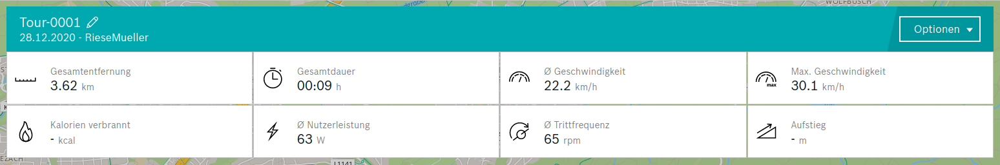
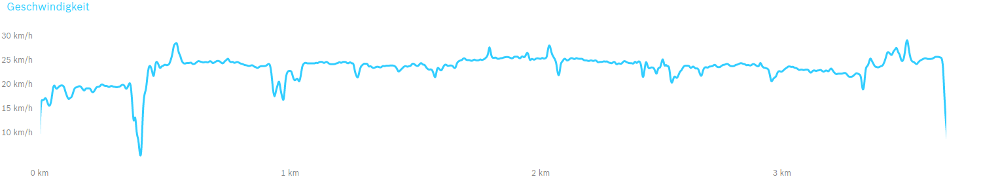
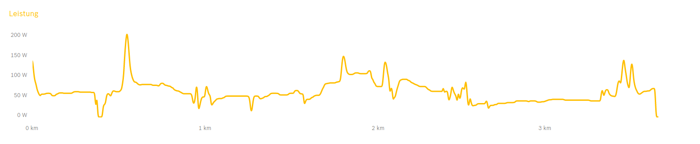
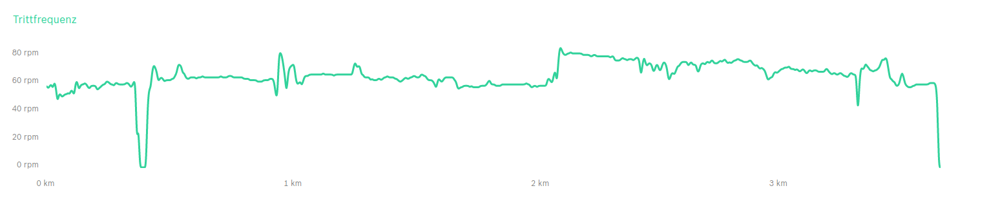
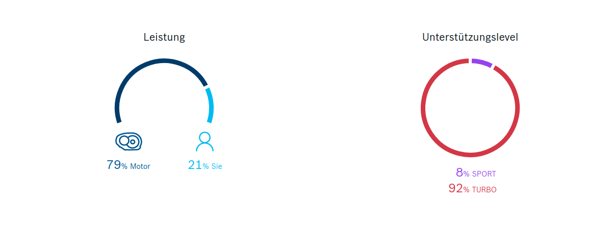

- [Tour](#Tour)
  - [BOSCH eBike-connect](#BOSCH-eBike-connect)
  - [Indoor DIY Testbench](#Testbench)

# Tour
Simulated tour with connected Android App and CAN Bus logger. To simulate a ride with GPS data you can mock your location with [io.appium.settings](https://github.com/appium/io.appium.settings)
## BOSCH eBike-connect

Source: Bosch [ebike-connect.com](https://www.ebike-connect.com/)

## Legend
| german            | english| unit/einheit|
|:------------------|:-------|:--------|
| Geschwindigket    | speed | [km/h] |
| Listung           | power | [W] |
| Trittfrequenz     | cadence | [rpm]|
| Nutzerleistung Ø  | human/user power Ø | [W]|
| Gesamntentfernung | tour distance total | [km] |
| Gesamtdauer       | tour duration | [h]

## Testbench

## CAN Bus log
[candump-tour-001.log](candump-tour-001.log)