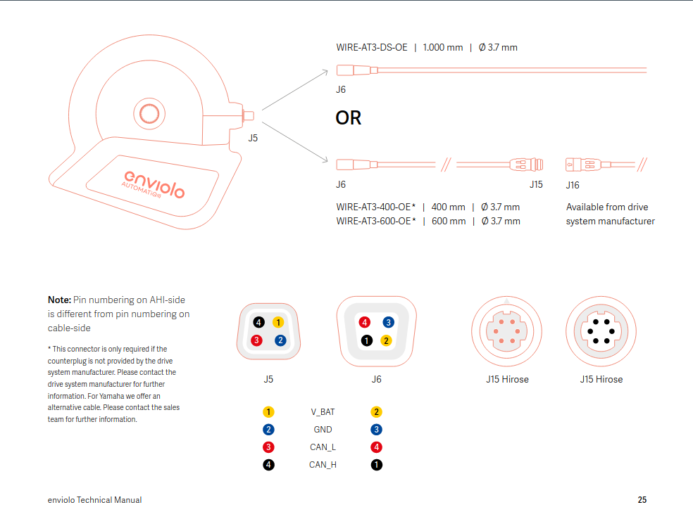
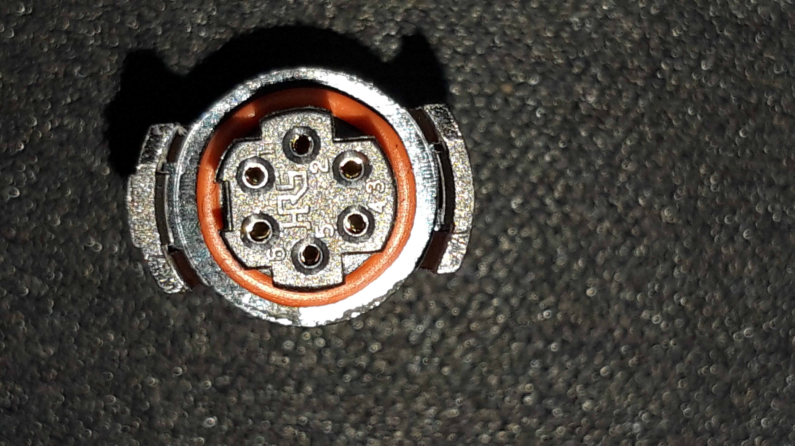

# Enviolo AUTOMATiQ

[Manual Page 29](https://enviolo.com/wp-content/uploads/Technical-Manual-enviolo-CY2021_June-2021.pdf)

WIRE-AT3-400-OE or WIRE-AT3-600-OE [Enviolo Main Cable - elektrofahrrad24.de](https://www.elektrofahrrad24.de/enviolo-automatiq-hauptkabel)

J16: [Hirose HR30-6PB-6S / HR30-6PB-6S ](https://www.hirose.com/de/product/document?clcode=&productname=&series=HR30&documenttype=Catalog&lang=de&documentid=D49406_en) 

**Distributor:**
  - [mouser.de - HR30-6PB-6S](https://www.mouser.de/ProductDetail/Hirose-Connector/HR30-6PB-6S?qs=sGAEpiMZZMtneIuP4Zx3qSkiEfqOq13WfNdofNGQK5w%3D)
  - [digikey.de - HR30-6PB-6S](https://www.digikey.de/de/products/detail/hirose-electric-co-ltd/HR30-6PB-6S/2268389)

**TO DO:**

  - Mapping J6<-->J15
  - Build Y cabel Battery (V_BAT,GND) Drive Unit 4 Port (CAN_L,CAN_H)

## Links
https://enviolo.com/wp-content/uploads/Technical-Manual-enviolo-CY2021_June-2021.pdf